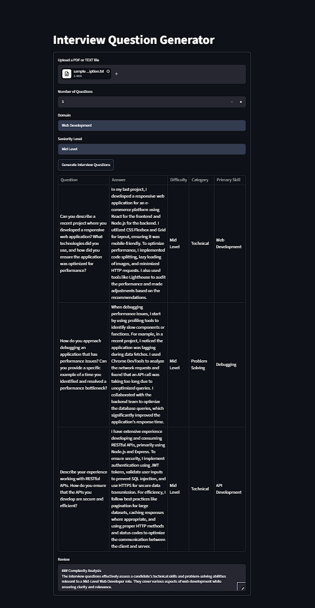

# Interview Question Generator

Turn a job description into a ready-to-use interview script.

Upload a JD, say how many questions you want and who you're hiring, and the app generates interview questions drawn **only** from that job description — each one tagged with the skill it probes and paired with a model answer — then runs a second pass to critique the set for relevance, coverage, and seniority fit.

Built with LangChain, OpenAI, and Streamlit.

---

## Demo



---

## How it works

```
  PDF / TXT job description
        │
        ▼
  read_file()                      extract raw text (pypdf for PDFs)
        │
        ▼
  question_generation_prompt       inject the JD, question count, domain,
        │                          seniority, and a JSON schema to imitate
        ▼
  gpt-4o-mini  ──►  JsonOutputParser      ──►  questions (dict)
        │
        ▼
  question_evaluation_prompt       hand the questions back to the model,
        │                          this time as an interview panelist
        ▼
  gpt-4o-mini  ──►  StrOutputParser       ──►  review (prose)
        │
        ▼
  get_table_data()  ──►  pandas DataFrame  ──►  st.table
```

Two LLM calls, chained. The first **writes** the questions; the second **critiques and revises** them. 

```python
question_chain = RunnablePassthrough.assign(
    questions=question_generation_prompt | llm | JsonOutputParser()
)
question_review_chain = RunnablePassthrough.assign(
    review=question_evaluation_prompt | llm | StrOutputParser()
)

evaluation_chain = question_chain | question_review_chain
```

`RunnablePassthrough.assign` accumulates keys as data flows through, so the final result carries the original inputs *plus* `questions` and `review`.

**Three details that matter:**

- **The schema is part of the prompt.** `Response.json` holds a dummy question structure that gets injected into the prompt, so the model has an exact shape to imitate rather than inventing its own. It is a JSON *object* keyed `"1"`, `"2"`, `"3"` — not an array — because `get_table_data()` iterates it with `.items()`.
- **The parser is the boundary.** An LLM returns *text*, not data — often wrapped in markdown fences. `JsonOutputParser` handles that and hands downstream code a real dict. Nothing after it re-parses.
- **Every question must cite the JD.** The schema forces a `primary_skill` field, so the model has to name the requirement each question tests. That's the leash on hallucination: it makes it hard to smuggle in a generic question that would fit any job posting.

---

## Tech stack

| | |
|---|---|
| **Language** | Python 3.14 |
| **LLM** | OpenAI `gpt-4o-mini` |
| **Orchestration** | LangChain 1.3 (LCEL) |
| **UI** | Streamlit |
| **PDF parsing** | pypdf |
| **Config** | python-dotenv |

---

## Setup & run

**1. Clone**

```bash
git clone https://github.com/kushalagarwalla/Interview-Question-Generator.git
cd Interview-Question-Generator
```

**2. Create an environment**

```bash
conda create -p env python=3.14 -y
conda activate ./env
```

**3. Install**

```bash
pip install -r requirements.txt
```

This installs the dependencies *and* the local `src/` package in editable mode (that's the `-e .` line at the bottom of `requirements.txt`), which is what lets the app import `src.InterviewQuestionGenerator` from anywhere.

**4. Add your API key**

Create a `.env` file in the project root:

```
OPENAI_API_KEY=sk-your-key-here
```

The variable name must be uppercase. Get a key at [platform.openai.com](https://platform.openai.com/api-keys).

**5. Run**

```bash
streamlit run StreamLitApp.py
```

Opens at `http://localhost:8501`.

> **Windows note:** run this from **PowerShell or Anaconda Prompt**, not Git Bash. Conda's OpenSSL activation script for Unix shells points `SSL_CERT_FILE` at a path that doesn't exist on Windows, which makes every OpenAI call fail with a confusing `FileNotFoundError`.

> Run it from the **project root**. `Response.json` is opened by relative path, so launching from elsewhere gives you a `FileNotFoundError`.

---

## Using the app

Once it's running at `http://localhost:8501`:

1. **Upload a file** — a `.pdf` or `.txt` containing the job description. Questions are drawn only from this text, so a detailed JD gives sharper questions than a two-line one.
2. **Number of questions** — anywhere from 3 to 30.
3. **Domain** — e.g. `AI/ML`, `DevOps`, `Product Management`. Steers the flavour of the questions. If the JD contradicts the domain, the JD wins.
4. **Seniority level** — e.g. `Entry Level`, `Mid-Level`, `Senior`, `Staff`. This does real work: it shifts the questions from fundamentals and coding basics toward architecture, tradeoffs, and mentorship.
5. **Click "Generate Interview Questions"** and wait a few seconds while the two LLM calls run.

You'll get back:

- **A table** of questions — each with a model answer, a difficulty, a category, and the specific skill from the JD it probes.
- **A review** — the model's own critique of the set: whether it covers the required skills, whether it matches the stated seniority, and any revisions it made.

Token usage for the run is printed to the terminal and written to `logs/`.

---

## Project structure

```
Interview Question Generator/
├── StreamLitApp.py            # entry point — Streamlit UI
├── Response.json              # question schema template injected into the prompt
├── setup.py                   # makes src/ an installable package
├── requirements.txt
│
├── src/InterviewQuestionGenerator/
│   ├── InterviewQuestionGenerator.py   # the LLM chain: prompts + LCEL wiring
│   ├── utils.py                        # file reading (PDF/TXT) + table formatting
│   └── logger.py                       # timestamped logging into logs/
│
└── experiment/
    ├── InterviewQuestionGenerator.ipynb    # the notebook this was prototyped in
    └── sample_job_description.txt          # sample input
```

The split is deliberate: **`src/InterviewQuestionGenerator/` is a library** that knows nothing about the web, and **`StreamLitApp.py` is one way of calling it.** The chain doesn't open files itself — `read_file()` takes a *file object*, not a path — which is why the same code serves both a local file in the notebook and a browser upload in Streamlit.

---

## Known limitations

- **Nothing checks that you got the questions you asked for.** The prompt asks for exactly *N*; if the model returns fewer, the table is just shorter. There's no assertion.
- **Scanned PDFs won't work.** `pypdf` extracts embedded text; it isn't OCR. A PDF of photographed pages yields nothing.
- **No chunking.** The whole job description goes into one prompt. Fine for a JD, but a very long document would exceed the context window.
- **The generation prompt is large** (~2,500 input tokens), and it is re-sent on every call. That dominates the cost of a run.
- **Cost isn't shown in the UI.** Token counts are captured via `get_usage_metadata_callback` and printed to the console, but not surfaced to the user or converted to dollars.
- **Not deployed.**
